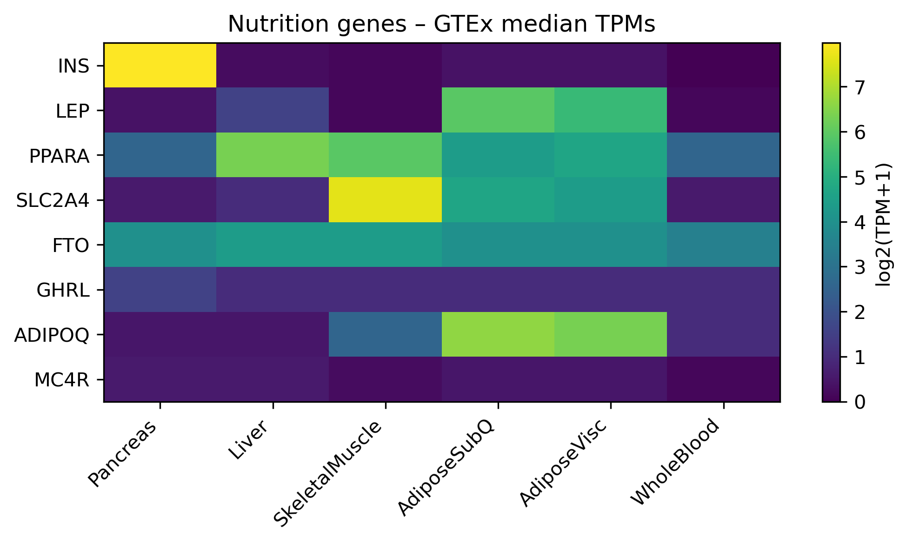

# Nutrition-Gene Expression Heat-map

This mini-project demonstrates a **basic RNA-Seq data workflow in Python**:

1. Load a tidy `counts.tsv` table of median TPM values for eight nutrition-related genes (INS, LEP, PPARA, SLC2A4, FTO, GHRL, ADIPOQ, MC4R) across six GTEx tissues.  
2. Log₂-transform the data to stabilise variance.  
3. Visualise gene–tissue expression patterns with a heat-map (`matplotlib`).  
4. Inspect per-gene descriptive statistics with `pandas`.

Everything runs in a single Jupyter notebook (`expression_heatmap.ipynb`).  
The plot is saved as **`heatmap.png`** for quick viewing:

